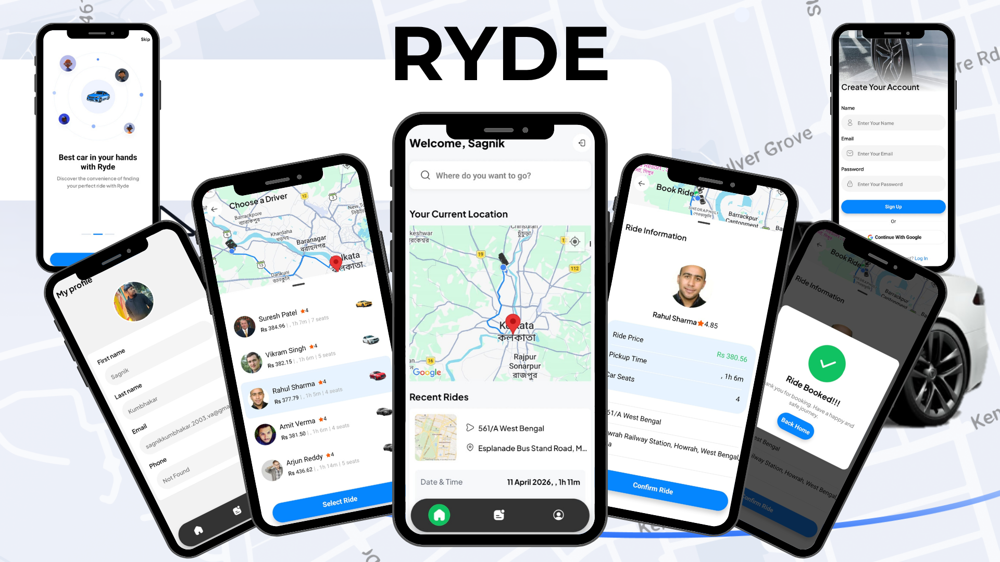

# Ryde



[](https://expo.dev/)
[](https://reactnative.dev/)
[](https://www.typescriptlang.org/)

## Table of Contents

- [What the Project Does](#what-the-project-does)
- [Why the Project Is Useful](#why-the-project-is-useful)
- [How Users Can Get Started](#how-users-can-get-started)
- [Where Users Can Get Help](#where-users-can-get-help)
- [Who Maintains and Contributes](#who-maintains-and-contributes)

## What the Project Does

Ryde is a mobile ride-booking application built with Expo and React Native.

It provides:

- Authentication with Clerk (email/password + verification + Google OAuth)
- Location selection and map routing
- Driver selection with dynamic fare and ETA
- Stripe payment flow
- Ride persistence and ride history via server routes backed by Neon Postgres

The project uses Expo Router with grouped routes for auth, app screens, and API routes:

- `app/(auth)` for onboarding and auth flows
- `app/(root)` for map and ride-booking experience
- `app/(api)` for data and payment endpoints

## Why the Project Is Useful

Ryde is useful as both a functional app and a full-stack Expo reference implementation.

### Key features

- End-to-end ride flow: set destination -> choose driver -> confirm payment -> save ride
- Distance-based pricing with Google Directions
- Live map + route polyline rendering
- Clerk session handling with custom OAuth continuation flow
- Serverless-style API routes colocated with app code
- Persistent ride history per authenticated user

### Technical benefits

- Good template for Expo Router + native capabilities (Maps, Stripe)
- Demonstrates secure auth/session handling with Clerk
- Shows production-style API composition with Neon Postgres and Stripe
- Uses Zustand for lightweight shared state

## How Users Can Get Started

### Prerequisites

- Node.js 18+
- npm 9+
- Android Studio (for Android emulator/device testing)
- Xcode (for iOS, macOS only)
- A Clerk application
- A Stripe account with API keys
- A Neon Postgres database
- A Google Maps API key (Directions + Places + Maps SDK)

### 1. Install dependencies

```bash
npm install
```

### 2. Configure environment variables

Create `.env` in the repository root:

```bash
EXPO_PUBLIC_CLERK_PUBLISHABLE_KEY=...
DATABASE_URL=...
EXPO_PUBLIC_GOOGLE_API_KEY=...
EXPO_PUBLIC_GEOAPIFY_API_KEY=...
EXPO_PUBLIC_STRIPE_PUBLISHABLE_API_KEY=...
STRIPE_SECRET_KEY=...
```

### 3. Configure OAuth redirect URL in Clerk

In your Clerk Native Application settings, add:

```text
ryde://continue
```

### 4. Run the app

```bash
# Start dev server
npm run start

# Build + run Android dev build
npm run android

# Build + run iOS dev build (macOS only)
npm run ios

# Web
npm run web
```

### 5. Typical usage flow

1. Sign in or create an account (email/password or Google OAuth)
2. Set pickup and destination
3. Select a driver from the bottom sheet list
4. Review fare and ETA
5. Confirm payment and complete booking
6. View recent/all rides in the rides tab

### Useful scripts

- `npm run start` -> starts Expo dev server
- `npm run android` -> runs Android dev build
- `npm run ios` -> runs iOS dev build
- `npm run web` -> starts web target
- `npm run lint` -> runs Expo linting

### Project structure

```text
app/
  (auth)/           # welcome, sign-in, sign-up, OAuth continue
  (root)/           # tabs + ride flow screens
  (api)/            # users, driver, rides, stripe endpoints
components/         # UI + map + payment + auth helpers
lib/                # fetch/map/utils helpers
store/              # Zustand stores
assets/             # images, icons, fonts
```
